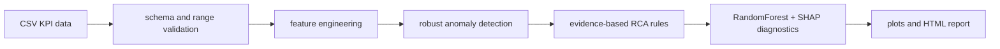

# RAN KPI Root-Cause Analysis Toolkit

Engineering-focused Python toolkit for analyzing synthetic 4G/5G RAN KPI degradation and producing reproducible root-cause analysis reports.

This repository is intentionally practical: no dashboard, no optimization claims, and no confidential operator data. The goal is to demonstrate KPI validation, automation, explainable diagnostics, testing discipline, and Linux-friendly reproducibility.

## What It Does

Given a cell-level KPI time series, the analyzer:

- validates the input schema and KPI ranges
- detects anomalous KPI periods
- classifies likely degradation patterns
- ranks KPI contributors with rule-based and ML-assisted explanations
- generates five engineering plots
- produces an HTML report with troubleshooting recommendations

Supported diagnostic scenarios:

- coverage limitation
- interference degradation
- capacity congestion
- mobility degradation
- healthy baseline operation

## Engineering Scope

This project is a validation and reporting toolkit, not a field-accurate RAN optimizer. It uses synthetic data because real operator KPI data is confidential. The thresholds and relationships are documented in [engineering assumptions](docs/engineering_assumptions.md) and are meant to be reviewable.

## Repository Layout

```text
.
├── main.py
├── src/ran_kpi_analyzer/
│   ├── data_loader.py
│   ├── preprocessing.py
│   ├── anomaly_detection.py
│   ├── root_cause.py
│   ├── modeling.py
│   ├── visualization.py
│   └── report_generator.py
├── data/raw/sample_ran_kpi_data.csv
├── reports/example_report.html
├── reports/figures/
├── tests/
├── docs/
├── Dockerfile
├── Makefile
├── pyproject.toml
├── uv.lock
└── .github/workflows/ci.yml
```

## Architecture



The RCA rules remain transparent. The ML step is used as a diagnostic feature ranking and consistency check, not as an autonomous decision engine.

## Example Outputs

The checked-in sample run produces:

- [HTML engineering report](reports/example_report.html)
- [KPI trend plot](reports/figures/kpi_trends.png)
- [throughput vs latency plot](reports/figures/throughput_vs_latency.png)
- [anomaly timeline](reports/figures/anomaly_timeline.png)
- [root-cause distribution](reports/figures/root_cause_distribution.png)
- [model feature importance](reports/figures/feature_importance.png)

## Quick Start

Install `uv` first:

```bash
curl -LsSf https://astral.sh/uv/install.sh | sh
```

Clone the repository and install the locked environment:

```bash
git clone https://github.com/WW6889/ran-kpi-root-cause-analyzer.git
cd ran-kpi-root-cause-analyzer
uv sync
```

Run the checks and generate the sample report:

```bash
uv run pytest
uv run python main.py --input data/raw/sample_ran_kpi_data.csv --output reports/example_report.html
```

The `Makefile` wraps the same uv commands:

```bash
make setup
make test
make run
```

## CLI

```bash
uv run python main.py \
  --input data/raw/sample_ran_kpi_data.csv \
  --output reports/example_report.html \
  --log-level INFO
```

The package also exposes a console script:

```bash
uv run ran-kpi-analyzer \
  --input data/raw/sample_ran_kpi_data.csv \
  --output reports/example_report.html
```

Invalid inputs return exit code `2` with a clear validation error.

## Regenerate Synthetic Data

```bash
uv run python -m ran_kpi_analyzer.synthetic_data
```

The generator is deterministic by default and creates coverage, interference, congestion, mobility, and healthy baseline cells.

## Quality Gates

```bash
make format
make lint
make typecheck
make test
```

CI runs formatting, linting, type checks, tests with coverage, and report generation.

The project uses `pyproject.toml` for runtime dependencies, development dependency groups, package metadata, CLI entry points, and tool configuration. `uv.lock` pins the resolved dependency graph for reproducible local and CI runs.

## Docker

```bash
docker build -t ran-kpi-analyzer .
docker run --rm ran-kpi-analyzer
```

## Key Assumptions

- RSRP below `-108 dBm` is strong coverage evidence.
- SINR below `5 dB` with normal RSRP and low CQI is interference evidence.
- Congestion requires load symptoms: high PRB utilization, high active users, high latency, and low throughput per user.
- Mobility degradation requires handover/drop symptoms and should not be inferred from throughput alone.

See [engineering assumptions](docs/engineering_assumptions.md) for details and limitations.

## Documentation

- [Architecture](docs/architecture.md)
- [Engineering assumptions](docs/engineering_assumptions.md)
- [Sample case study](docs/sample_case_study.md)
- [Dependency list](docs/dependencies.md)
- [Final engineering review](docs/final_engineering_review.md)

## Limitations

- Synthetic KPI data cannot prove field accuracy.
- Vendor-specific counters, topology, alarms, trace data, and configuration history are outside the project scope.
- SHAP explanations depend on the trained diagnostic model and should be interpreted as feature influence, not physical causality.

## Maintainer

Omid Rahimi
