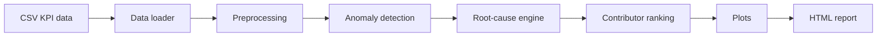

# RAN KPI Root-Cause Analysis Toolkit

A Python-based engineering toolkit for detecting KPI degradation and generating reproducible root-cause analysis reports for 4G/5G RAN systems.

This project uses synthetic KPI data because real operator data is confidential. The KPI relationships and troubleshooting logic are based on practical RAN engineering patterns.

## Why This Project Exists

RAN performance work often requires quickly separating weak coverage, interference, capacity congestion, and mobility problems from healthy baseline behavior. This project demonstrates a reproducible workflow for KPI validation, anomaly detection, explainable root-cause classification, visualization, and HTML reporting.

## Engineering Problem

Given a time-series KPI dataset per cell, the toolkit identifies degraded periods, classifies likely root causes, ranks KPI contributors, and produces an engineering report with plots and recommended troubleshooting actions.

## Features

- Synthetic but realistic RAN KPI dataset
- CSV schema validation and timestamp handling
- KPI cleaning, engineered features, and degradation labels
- Z-score and robust anomaly scoring
- Rule-based root-cause classification
- Ranked KPI contributor analysis
- Five report figures
- Automated HTML engineering report
- Unit tests, Dockerfile, and GitHub Actions CI

## Architecture



## Dataset

The sample data includes:

- `timestamp`
- `cell_id`
- `band`
- `rsrp_dbm`
- `sinr_db`
- `cqi`
- `prb_utilization_dl`
- `throughput_dl_mbps`
- `latency_ms`
- `packet_loss_rate`
- `rrc_setup_success_rate`
- `handover_success_rate`
- `call_drop_rate`
- `active_users`

Implemented scenarios:

- Coverage limitation
- Interference degradation
- Capacity congestion
- Mobility degradation
- Healthy baseline operation

## Root-Cause Logic

- Coverage limitation: low RSRP and low throughput
- Interference: low SINR, reduced CQI, normal RSRP
- Capacity congestion: high PRB utilization and high active users
- Mobility degradation: low handover success rate and elevated call drop rate
- Healthy baseline: stable KPIs outside degradation thresholds

## Example Outputs

Running the project creates:

- `reports/example_report.html`
- `reports/figures/kpi_trends.png`
- `reports/figures/throughput_vs_latency.png`
- `reports/figures/anomaly_timeline.png`
- `reports/figures/root_cause_distribution.png`
- `reports/figures/feature_importance.png`

## Installation

```bash
python -m venv .venv
source .venv/bin/activate
pip install -r requirements.txt
```

## How To Run

```bash
python main.py --input data/raw/sample_ran_kpi_data.csv --output reports/example_report.html
```

To regenerate the synthetic dataset:

```bash
python -m ran_kpi_analyzer.synthetic_data
```

## Tests

```bash
pytest
```

## Docker

```bash
docker build -t ran-kpi-analyzer .
docker run ran-kpi-analyzer
```

## Limitations

- Synthetic data cannot represent all vendor-specific counters or field conditions.
- Root-cause rules are transparent engineering heuristics, not a replacement for drive tests, traces, configuration audits, or topology review.
- SHAP and XGBoost are listed as future-compatible explainability/modeling dependencies, but the default implementation stays deterministic and lightweight for reproducible CI.

## Future Improvements

- Add vendor-specific counter mapping profiles
- Add optional scikit-learn RandomForest model training
- Add SHAP plots when the optional dependency is installed
- Add topology-aware neighbor cell analysis
- Add KPI baseline drift monitoring

## Author

Omid Rahimi
