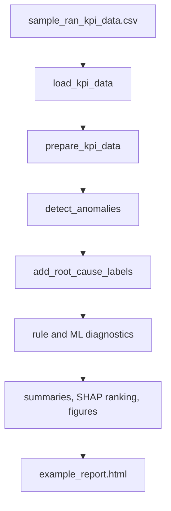

# Architecture Review

The project is organized as a deterministic engineering pipeline:

1. `data_loader.py` loads CSV data, validates the expected KPI schema, parses timestamps, and rejects missing values.
2. `preprocessing.py` clamps impossible values, creates engineered features, labels degraded samples, and aggregates cell-level KPIs.
3. `anomaly_detection.py` adds robust z-score flags, rolling throughput deviation, and IsolationForest anomaly scores.
4. `root_cause.py` applies transparent evidence-based diagnostics for coverage, interference, congestion, mobility, and healthy baseline cases.
5. `modeling.py` trains a deterministic RandomForest classifier and ranks feature impact with SHAP when available.
6. `visualization.py` creates five static plots for reproducible reporting.
7. `report_generator.py` builds the HTML engineering report.

The design favors deterministic outputs and readable rules so reviewers can inspect each decision. The ML component is intentionally diagnostic; it does not replace engineering thresholds or claim autonomous optimization.
