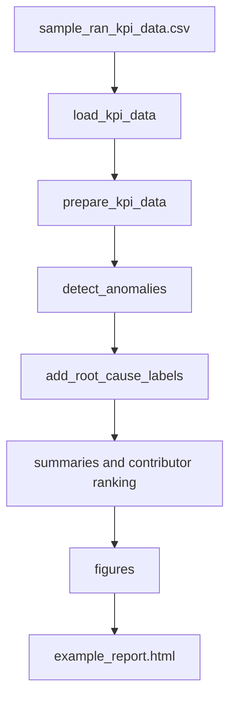

# Architecture

The project is organized as a small engineering pipeline:

1. `data_loader.py` loads CSV data, validates the expected KPI schema, parses timestamps, and rejects missing values.
2. `preprocessing.py` clamps impossible values, creates engineered features, labels degraded samples, and aggregates cell-level KPIs.
3. `anomaly_detection.py` adds z-score anomaly flags, rolling throughput deviation, and a robust distance score.
4. `root_cause.py` applies transparent rule-based diagnostics for coverage, interference, congestion, mobility, and healthy baseline cases.
5. `visualization.py` creates five static plots for reproducible reporting.
6. `report_generator.py` builds the HTML engineering report.

The design favors deterministic outputs and readable rules so reviewers can inspect each decision.

